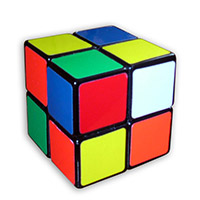

<div align="center">

  [](#readme)

</div>

# Pocket Cube Experiment

According to [Wikipedia](https://en.wikipedia.org/wiki/Pocket_Cube#Permutations) there are 3674160 different pocket cube states.

[](#readme)

This project demonstrates how to generate all the possible states of the pocket cube using Python and [cfly](https://github.com/pymet/cfly).

The entire source code is in the [pocket_cube.py](pocket_cube.py). It is less then 50 lines of code.

The pocket cube is represented with 21-permutations. The solved cube and the moves can be found [here](#cubes).

**pocket_cube.py**

```py
import time

import cfly

core = cfly.build_module('core', '''
#include <Python.h>

PyObject * meth_move(PyObject * self, PyObject * args) {
    PyObject * res = PyBytes_FromStringAndSize(0, 21);
    unsigned char * a = (unsigned char *)PyBytes_AS_STRING(PyTuple_GET_ITEM(args, 0));
    unsigned char * b = (unsigned char *)PyBytes_AS_STRING(PyTuple_GET_ITEM(args, 1));
    unsigned char * c = (unsigned char *)PyBytes_AS_STRING(res);
    for (int i = 0; i < 21; ++i) {
        c[i] = a[b[i]];
    }
    return res;
}
''')

solved = bytes(range(21))
moves = [
    bytes([2, 0, 3, 1, 6, 7, 8, 9, 10, 11, 4, 5, 12, 13, 14, 15, 16, 17, 18, 19, 20]),
    bytes([0, 1, 17, 11, 12, 4, 2, 7, 8, 9, 10, 18, 13, 5, 3, 15, 16, 19, 14, 6, 20]),
    bytes([0, 5, 2, 13, 4, 19, 14, 6, 3, 9, 10, 11, 12, 20, 15, 7, 1, 17, 18, 16, 8]),
    bytes([1, 3, 0, 2, 10, 11, 4, 5, 6, 7, 8, 9, 12, 13, 14, 15, 16, 17, 18, 19, 20]),
    bytes([0, 1, 6, 14, 5, 13, 19, 7, 8, 9, 10, 3, 4, 12, 18, 15, 16, 2, 11, 17, 20]),
    bytes([0, 16, 2, 8, 4, 1, 7, 15, 20, 9, 10, 11, 12, 3, 6, 14, 19, 17, 18, 5, 13]),
]

inv = {a: b for a in moves for b in moves if core.move(a, b) == solved}

start = time.clock()
distance = {solved: 0}
for i in range(15):
    todo = [k for k, v in distance.items() if v == i]
    print('%d pocket cubes with a solution of %d moves' % (len(todo), i))
    for cube in todo:
        for move in moves:
            moved = core.move(cube, move)
            distance.setdefault(moved, i + 1)

print('it took %.2f seconds to finish' % (time.clock() - start))

```

**output**

```s
1 pocket cubes with a solution of 0 moves
6 pocket cubes with a solution of 1 moves
27 pocket cubes with a solution of 2 moves
120 pocket cubes with a solution of 3 moves
534 pocket cubes with a solution of 4 moves
2256 pocket cubes with a solution of 5 moves
8969 pocket cubes with a solution of 6 moves
33058 pocket cubes with a solution of 7 moves
114149 pocket cubes with a solution of 8 moves
360508 pocket cubes with a solution of 9 moves
930588 pocket cubes with a solution of 10 moves
1350852 pocket cubes with a solution of 11 moves
782536 pocket cubes with a solution of 12 moves
90280 pocket cubes with a solution of 13 moves
276 pocket cubes with a solution of 14 moves
it took 16.88 seconds to finish
```

## Cubes

**The solved cube**

```s
+-------+
|  0  1 |
|  2  3 |
+-------+-------+-------+-------+
|  4  5 |  6  7 |  8  9 | 10 11 |
| 12 13 | 14 15 | 16  . |  . 17 |
+-------+-------+-------+-------+
| 18 19 |
|  . 20 |
+-------+
```

**moves[0]**

```s
+-------+
|  2  0 |
|  3  1 |
+-------+-------+-------+-------+
|  6  7 |  8  9 | 10 11 |  4  5 |
| 12 13 | 14 15 | 16  . |  . 17 |
+-------+-------+-------+-------+
| 18 19 |
|  . 20 |
+-------+
```

**moves[1]**

```s
+-------+
|  0  1 |
| 17 11 |
+-------+-------+-------+-------+
| 12  4 |  2  7 |  8  9 | 10 18 |
| 13  5 |  3 15 | 16  . |  . 19 |
+-------+-------+-------+-------+
| 14  6 |
|  . 20 |
+-------+
```

**moves[2]**

```s
+-------+
|  0  5 |
|  2 13 |
+-------+-------+-------+-------+
|  4 19 | 14  6 |  3  9 | 10 11 |
| 12 20 | 15  7 |  1  . |  . 17 |
+-------+-------+-------+-------+
| 18 16 |
|  .  8 |
+-------+
```

**moves[3] (inverse of moves[0])**

```s
+-------+
|  1  3 |
|  0  2 |
+-------+-------+-------+-------+
| 10 11 |  4  5 |  6  7 |  8  9 |
| 12 13 | 14 15 | 16  . |  . 17 |
+-------+-------+-------+-------+
| 18 19 |
|  . 20 |
+-------+
```

**moves[4] (inverse of moves[1])**

```s
+-------+
|  0  1 |
|  6 14 |
+-------+-------+-------+-------+
|  5 13 | 19  7 |  8  9 | 10  3 |
|  4 12 | 18 15 | 16  . |  .  2 |
+-------+-------+-------+-------+
| 11 17 |
|  . 20 |
+-------+
```

**moves[5] (inverse of moves[2])**

```s
+-------+
|  0 16 |
|  2  8 |
+-------+-------+-------+-------+
|  4  1 |  7 15 | 20  9 | 10 11 |
| 12  3 |  6 14 | 19  . |  . 17 |
+-------+-------+-------+-------+
| 18  5 |
|  . 13 |
+-------+
```
